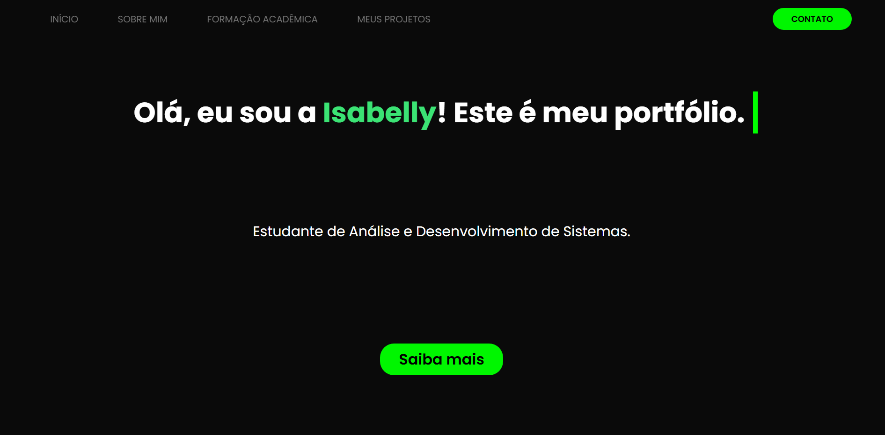

# :pushpin: Portfólio Pessoal :bust_in_silhouette:

Bem-vindo(a) ao meu portfólio pessoal! 🚀  
Aqui apresento quem sou, minha trajetória, hobbies, formação e alguns projetos acadêmicos.

---

## 	:open_file_folder: Estrutura de Pastas

/  
|-- index.html  
|-- /src  
    |-- /images  
    |-- /css  
    |-- /js (se tiver scripts)  
|-- README.md  

---

## :desktop_computer: Tecnologias Utilizadas

- HTML5
- CSS3
- JavaScript

---

## :framed_picture: Prévia do site:

---

## :link: Acessar

Você pode visualizar o site em:

https://umaisaduasbeli.github.io/trabalho-portifolio/
